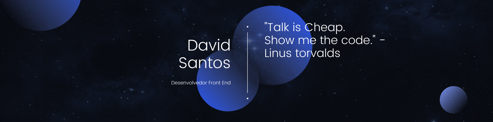

## Olá mundo! 👋🏻
Me chamo David Santos, sou estudante de Desenvolvimento de Sistemas. Sou apaixonado por programação, programar para mim, é uma arte: onde havia um espaço em branco, com algumas linhas de código, consigo recriar o mundo e seus objetos ao meu redor. Busco sempre estudar e aprimorar minhas habilidades para me manter atualizado e oferecer as melhores soluções possíveis. Atualmente estou focado na Linguagem Java e conceitos de POO(Programação orientada a objetos).

Atualmente também estou com um projeto de [blog](https://medium.com/@dvctrl) afim de contribuir para a comunidade de desenvolvedores!

 

## Tecnologias
**`HTML/CSS`** **`JavaScript`** **`BootStrap`** **`PHP`** **`MySQL`** **`Java`** **`Python`** **`NPM`** **`AndroidStudio`** **`Xampp`** **`Git`** **`GitHub`** **`Eclipse IDE`** **`Visual Studio Code`** **`Intellij IDEA`**

<!-- Proudly created with GPRM ( https://gprm.itsvg.in ) -->

